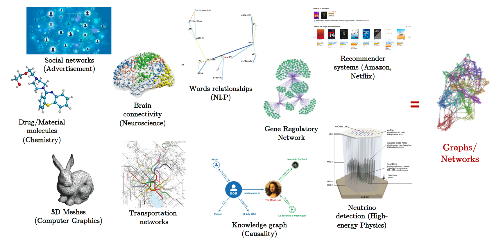
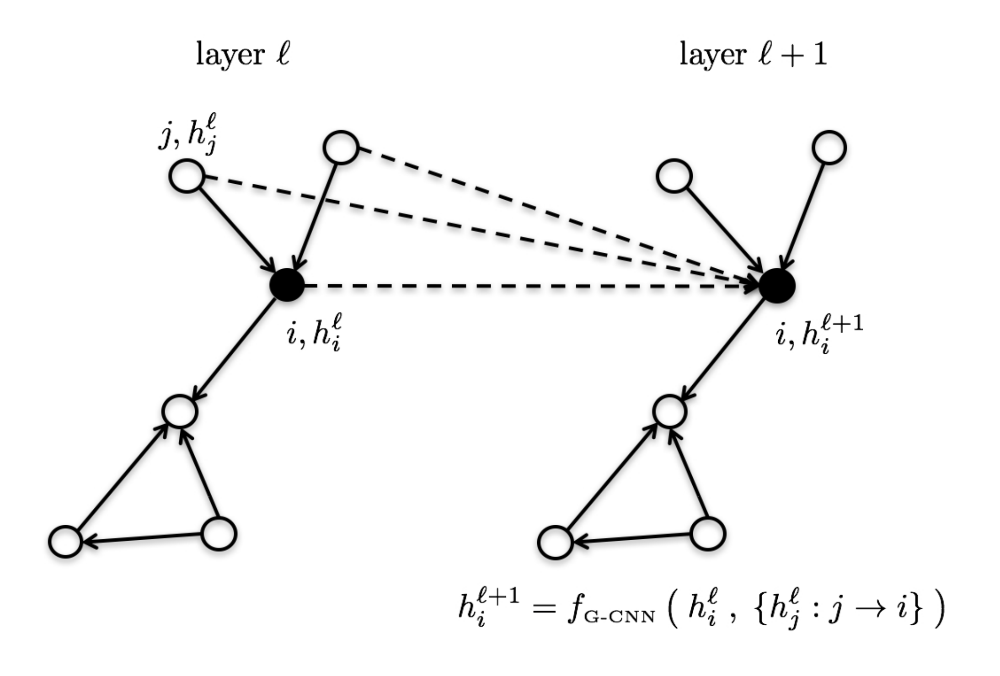

## Non-Euclidean and Graph-structured Data

Classic deep learning architectures such as [Convolutional Neural Networks (CNNs)](http://yann.lecun.com/exdb/publis/pdf/lecun-01a.pdf) and [Recurrent Neural Networks (RNNs)](https://www.bioinf.jku.at/publications/older/2604.pdf) require the input data domain to be regular, such as 2D or 3D Euclidean grids for Computer Vision and 1D lines for Natural Language Processing. 

However, real-world data beyond images and language tends to an underlying structure that is **non-Euclidean**.
Such complex data commonly occurs in science and engineering, and can be modelled intuitively by **heterogeneous graphs**.
Prominent examples include graphs of molecules, 3D meshes in computer graphics, social networks and biological networks.

---

## Graph Neural Networks

Obtaining insights from large and complex graph-structured datasets leads to an interesting challenge for machine learning architectures:
The popular CNN and RNN models need to be redesigned for handling non-Euclidean data, as they cannot leverage familiar regularities such as coordinate systems, vector space structure, or shift invariance.

**Graph/Geometric Deep Learning** is an umbrella term for emerging techniques attempting to generalize deep neural networks to non-Euclidean domains such as graphs and manifolds [[Bronstein *et al.*, 2017](https://arxiv.org/abs/1611.08097)].

{}
We are interested to designing neural networks for arbitrary graphs in order to solve *generic* graph problems, such as vertex classification, graph classification and graph generation.
{}

These Graph Neural Network (GNN) architectures are used as backbones for challenging domain-specific applications in a myriad of domains, including [chemistry](https://arxiv.org/abs/1704.01212), [social networks](https://arxiv.org/abs/1902.06673), [recommendations](https://arxiv.org/abs/1806.01973) and [computer graphics](https://arxiv.org/abs/1611.08402).

---

## Basic Formalism

Each GNN layer computes $d$-dimensional representations for the nodes/edges of the graph through recursive neighborhood diffusion (*a.k.a.* message passing), where each graph node gathers features from its neighbors to represent local graph structure.
Stacking $L$ GNN layers allows the network to build node representations from the **$L$-hop neighborhood** of each node.

Let $h_i^{\ell}$ denote the feature vector at layer $\ell$ associated with node $i$.
The updated features $h_i^{\ell+1}$ at the next layer $\ell+1$ are obtained by applying non-linear transformations to the central feature vector $h_i^{\ell}$ and the feature vectors $h_{j}^{\ell}$ for all nodes $j$ in the neighborhood of node $i$ (defined by the graph structure). 
This guarantees the transformation to build local reception fields, such as in standard ConvNets for computer vision, and be invariant to both graph size and vertex re-indexing.

Thus, the most generic version of a feature vector $h_i^{\ell+1}$ at vertex $i$ at the next layer in the GNN is:
\begin{equation} 
    h_{i}^{\ell+1} =  f \left( \ h_i^{\ell} \  , \ \{ h_{j}^{\ell}: j \rightarrow i \}  \ \right) ,
\end{equation}
where $\{ j \rightarrow i \}$ denotes the set of neighboring nodes $j$ pointed to node $i$, which can be replaced by $\{ j \in \mathcal{N}_i \}$, the set of neighbors of node $i$, if the graph is undirected. 

---

## Classes of GNN Architectures

In other words, a GNN is defined by a mapping $f$ taking as input a vector $h_i^{\ell}$--the feature vector of the center vertex--as well as an un-ordered set of vectors {$\{ h_{j}^{\ell}\}$}--the feature vectors of all neighboring vertices. 
The arbitrary choice of the mapping $f$ defines an instantiation of a class of GNNs, <i>e.g.</i>, [GCN](https://arxiv.org/abs/1609.02907), [GraphSage](https://arxiv.org/abs/1706.02216), [GIN](https://arxiv.org/abs/1810.00826).

As an illustration, here's a simple-yet-effective Graph ConvNet from [Sukhbaatar *et al.*, 2016](https://arxiv.org/abs/1605.07736):
\begin{equation}
    h_{i}^{\ell+1} = \text{ReLU} \Big( U^{\ell} h_{i}^{\ell} + \sum_{j \in \mathcal{N}_i} V^{\ell} h_{j}^{\ell} \Big),
\end{equation}
where $U^{\ell}, V^{\ell} \in \mathbb{R}^{d \times d}$ are the learnable parameters.

In a [recent paper]() on benchmarking GNN architectures, we introduced **block diagrams** to intuitively describe feature update equations such as the one above:



---

## Anisotropic GNNs

As graphs have no specific orientations (like up, down, left, right directions in images), message-passing layers such as Sukhbaatar's Graph ConvNet are **isotropic**, treating all neighbors as equally important. 
However, this may not be true in general, *e.g.*, in social network graphs, neighbors in the same community share different relationships and information compared to neighbors from separate communities. 

Isotropic GNNs can be upgraded to make the diffusion process **anisotropic** through mechanisms which learn to weigh neighbors based on their relative importance. 
For example, [Marchegiani and Titov, 2017](https://arxiv.org/abs/1703.04826) upgrade Graph ConvNets by introducing **edge gating** for learning information flow on the graph structure for the task at hand:
\begin{equation}
    h_{i}^{\ell+1} = \text{ReLU} \Big( U^{\ell} h_{i}^{\ell} + \sum_{j \in \mathcal{N}_i} \eta_{ij} \odot V^{\ell} h_{j}^{\ell} \Big),
    \quad \text{where } \eta_{ij} = \sigma \big( A^{\ell} h_i^{\ell} + B^{\ell} h_j^{\ell} \big),
\end{equation}
$U^{\ell}, V^{\ell}, A^{\ell}, B^{\ell} \in \mathbb{R}^{d \times d}$ are the learnable parameters, $\sigma$ is the sigmoid function, $\odot$ is the element-wise product, and $\eta_{ij}$ act as edge gates.



Other prominent approaches to introduce anisotropy into GNNs include [GAT](https://arxiv.org/abs/1710.10903), which uses the [attention mechanism](https://arxiv.org/abs/1706.03762) from NLP, as well as [MoNet](https://arxiv.org/abs/1611.08402), which relies on gaussian mixture models of graph connectivity.
**Through [our benchmark](()), we found anisotropic aggregation to be a key property of powerful GNNs.**
